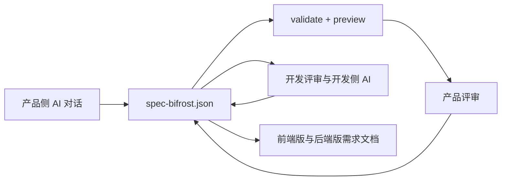

# Spec Bifrost

[English](README.en.md)

面向正在从零建设 B 端系统的产品研发团队：当产品和开发已经各自使用 AI、却没有共享上下文时，Spec Bifrost 用一份本地、可校验、可预览、可版本化的 `spec-bifrost.json` 连接双方。

这是一款面向产品经理和开发共同使用的 AI 需求协作插件。产品用 AI 描述和审查需求，开发继续让 AI 读取同一份结构化需求资产。团队不需要先信任 AI 生成的生产代码，也不需要反复转述页面、字段、流程、规则和备注。

> 状态：MVP。当前版本重点验证“产品与开发能否围绕同一份 AI 可读需求资产完成评审和交接”，而不是继续扩展组件数量。


## 适合谁

- 正在从零规划内部系统、运营后台或其他 B 端系统的小公司和大公司。
- 产品和开发都已经使用 AI，但两侧对话、提示词和上下文彼此分离的团队。
- 不愿直接信任 AI 生成生产代码，希望先审查需求、原型和规则的团队。
- 愿意让产品与开发共同试跑完整流程，而不是只看一次原型演示的团队。

## 为什么不是直接让 AI 写需求文档

直接让 AI 写文档很快，但每次对话都可能漂移：页面、字段、备注、交互规则和导出侧重点容易不一致。

Spec Bifrost 的核心选择是加一个本地 `spec-bifrost.json` 中间层：

- JSON 可校验：语法、schema 和引用错误会被明确指出。
- JSON 可预览：用户可以先看原型，再决定需求是否正确。
- JSON 可导出：同一份结构化需求可以裁剪成前端版和后端版文档。
- JSON 可追踪：它是本地项目资产，可以进 Git，可以审阅，可以逐步演进。

## Token 成本优势

在 token 成本敏感或预算收紧时，Spec Bifrost 的工作流通常更省 token：产品不需要先让 AI 生成一整套高保真原型，再让开发把原型转换为代码或需求说明。团队围绕一份紧凑的 `spec-bifrost.json` 迭代，预览和导出都复用这份结构化上下文。

这意味着 AI 不必反复读取大段截图描述、页面 HTML、设计稿说明或一次性长文档；它只需要修改可校验的 JSON，再由插件预览和导出。对于频繁修改页面、字段、流程和备注的早期产品阶段，这条路径更适合控制 token 成本。

## 为什么

产品和开发都在使用 AI，并不代表他们在共享上下文。产品侧 AI 形成原型或文档后，开发仍常常需要重新解释业务对象、字段口径、流程结果和例外，第二次转述会带来上下文丢失和语义漂移。

Spec Bifrost 验证的是一条共享需求资产链路：

1. 产品通过 Claude Code、Codex 或 OpenCode 描述一个新的 B 端系统。
2. AI 创建并修改本地 `spec-bifrost.json`。
3. 插件校验 JSON，并提供本地预览。
4. 产品根据预览修正页面、流程、字段、规则和备注。
5. 开发审查同一份 JSON，并让开发侧 AI 继续读取它。
6. 团队从同一份需求资产导出前端版和后端版需求文档。



## 能做什么

- 通过 Claude Code、Codex 或 OpenCode 的 skills/commands 引导创建和修改 `spec-bifrost.json`。
- 校验 JSON 语法、schema 和引用完整性。
- 提供中保真、多页面 B 端原型预览。
- 支持页面、section、组件、字段、动作和按钮上的 notes。
- 支持表单、筛选、表格、详情、步骤、卡片、空状态等常见 B 端表达。
- 支持指标、分组视图、弹窗、抽屉、时间线、树形层级、附件字段和批量操作等更复杂的需求表达。
- 支持可编辑明细、层级表格、对比表、看板、工作流、向导、进度、结果反馈、图表、日历、甘特、权限矩阵、规则清单、检查清单、审计日志、附件列表、评论串、组织结构、折叠面板和关系图。
- 支持字段规则、条件显示、条件必填和页面跳转。
- renderer 使用 last known good 策略，当前 JSON 渲染失败时保留上一版有效预览。
- 指导 Claude Code、Codex 或 OpenCode 导出前端版和后端版 Markdown 需求文档。

## 不做什么

- 不生成生产代码。
- 不提供低代码平台能力。
- 不模拟后端接口。
- 不持久化预览中的用户输入。
- 不导出接口定义、数据库设计、技术架构、代码结构或任务拆分。
- 不把后端文档写成实体模型或实现方案。
- 不上传 `spec-bifrost.json` 或导出文档。

## 仓库结构

```txt
.
├── .agents/plugins/marketplace.json
├── .claude-plugin/marketplace.json
├── docs/superpowers/
├── plugins/spec-bifrost/
│   ├── .claude-plugin/plugin.json
│   ├── .codex-plugin/plugin.json
│   ├── bin/spec-bifrost
│   ├── examples/procurement-system/
│   ├── hooks/hooks.json
│   ├── opencode.json
│   ├── skills/
│   ├── src/
│   │   ├── cli/
│   │   ├── core/
│   │   ├── hooks/
│   │   └── renderer/
│   └── tests/
├── package.json
└── tsconfig.json
```

- `plugins/spec-bifrost/src/core`：JSON 读取、诊断、schema 和引用校验。
- `plugins/spec-bifrost/src/hooks`：Claude Code 和 Codex hook 集成。
- `plugins/spec-bifrost/src/renderer`：本地预览服务和 HTML 渲染器。
- `plugins/spec-bifrost/src/cli`：本地 CLI 命令入口。
- `plugins/spec-bifrost/opencode.json`：OpenCode 命令入口，复用同一组 skills。
- `plugins/spec-bifrost/skills`：Claude Code、Codex 和 OpenCode 可加载的技能说明。
- `plugins/spec-bifrost/tests`：按模块组织的测试。

## 环境要求

- 推荐 Node.js 24 LTS。
- 需要 npm。
- 需要支持 plugin 的 Claude Code CLI、OpenAI Codex CLI/Desktop，或 OpenCode。

## 安装

从公开 GitHub marketplace 安装，不需要先 clone 仓库：

```bash
claude plugin marketplace add Liiaming/spec-bifrost
claude plugin install spec-bifrost@spec-bifrost-marketplace
```

Codex CLI 也可以直接注册同一个 GitHub marketplace：

```bash
codex plugin marketplace add Liiaming/spec-bifrost
codex plugin add spec-bifrost@spec-bifrost-marketplace
```

在 Codex Desktop 中，注册同一个 marketplace 后，插件会使用 `.codex-plugin/plugin.json` 的 `interface` 元数据在插件界面中展示。

OpenCode 不使用 Claude/Codex marketplace。保留或 clone 本仓库后，在目标项目目录用仓库内 OpenCode 配置启动：

```bash
OPENCODE_CONFIG=/path/to/spec-bifrost/plugins/spec-bifrost/opencode.json opencode
```

`OPENCODE_CONFIG` 加载 `plugins/spec-bifrost/opencode.json` 中的 `/spec-bifrost-*` 命令。命令模板会通过 OpenCode 的 `{file:...}` 变量内联同目录下的 skill 文档，不依赖额外的 skill discovery。

发布版本需要包含 `plugins/spec-bifrost/dist`，这样 marketplace 安装后的 `spec-bifrost` CLI 可以直接运行。发布前请先运行 `npm run build`，并把生成的 `plugins/spec-bifrost/dist` 一起提交。

## 5 分钟上手

在一个需要沉淀产品原型的新项目目录中启动 Claude Code 或 Codex，然后直接让插件创建第一版 JSON：

```txt
/spec-bifrost:spec
创建一个采购申请管理系统，包含申请单列表、创建申请、审批详情和基础审批流程。
```

生成或修改完成后，校验当前项目中的 `spec-bifrost.json`：

```txt
/spec-bifrost:validate
```

启动本地预览：

```txt
/spec-bifrost:preview
```

默认预览地址是 `http://127.0.0.1:3737`。如果端口没有释放，可以运行：

```txt
/spec-bifrost:stop
```

产品确认后导出两份需求文档：

```txt
/spec-bifrost:export
```

在 OpenCode 中使用对应的 hyphenated 命令名：

```txt
/spec-bifrost-spec
/spec-bifrost-validate
/spec-bifrost-preview
/spec-bifrost-refresh
/spec-bifrost-export
/spec-bifrost-stop
```

导出结果默认写入：

```txt
docs/spec-bifrost/frontend-requirements.md
docs/spec-bifrost/backend-requirements.md
```

- 前端版需求文档关注页面清单、页面流程、页面级说明、字段级说明和操作反馈。
- 后端版需求文档关注业务对象与字段口径、业务规则、流程结果、例外与备注。
- 两份文档都应保持需求文档属性，不包含接口定义、数据库设计、技术架构、代码结构或任务拆分。

### 把示例升级为一次团队试用

仅运行采购系统示例可以确认安装和预览是否正常；有效试用还需要产品和开发共同完成以下步骤：

1. 用一个真实但已脱敏的新 B 端项目创建自己的 `spec-bifrost.json`。
2. 产品根据预览修正至少一处需求。
3. 开发审查同一份 JSON，并指出至少一处歧义、缺失或可直接复用的信息。
4. 导出前端版和后端版需求文档。
5. 提交[试用反馈](https://github.com/Liiaming/spec-bifrost/issues/new?template=adoption_feedback.yml)，说明完成阶段、具体价值或具体阻塞。

完整采购示例试跑指南见 [`plugins/spec-bifrost/examples/procurement-system/README.md`](plugins/spec-bifrost/examples/procurement-system/README.md)。

## 本地开发测试安装

克隆仓库并构建插件：

```bash
git clone <repo-url>
cd spec-bifrost
npm install
npm run build
```

在 Claude Code 测试项目中使用 local scope 安装插件，避免修改全局 Claude Code 配置：

```bash
mkdir -p ~/Projects/Private/spec-bifrost-test
cd ~/Projects/Private/spec-bifrost-test
claude plugin marketplace add --scope local /path/to/spec-bifrost
claude plugin install --scope local spec-bifrost@spec-bifrost-marketplace
claude
```

在 Codex CLI 中注册当前仓库作为本地 marketplace，并安装插件：

```bash
codex plugin marketplace add /path/to/spec-bifrost
codex plugin add spec-bifrost@spec-bifrost-marketplace
codex
```

修改插件源码后，先重新构建，再更新测试项目中的本地安装：

```bash
cd /path/to/spec-bifrost
npm run build
cd ~/Projects/Private/spec-bifrost-test
claude plugin update spec-bifrost@spec-bifrost-marketplace --scope local
```

Codex 本地 marketplace 安装后，如需刷新源码改动，重新运行 marketplace add 或 remove/add，以当前 Codex CLI 版本的插件命令为准。

OpenCode 本地测试不需要安装 marketplace。构建后在测试项目目录启动：

```bash
OPENCODE_CONFIG=/path/to/spec-bifrost/plugins/spec-bifrost/opencode.json opencode
```

## Claude Code / Codex Skills

```txt
/spec-bifrost:spec
/spec-bifrost:validate
/spec-bifrost:preview
/spec-bifrost:refresh
/spec-bifrost:export
/spec-bifrost:stop
```

- `/spec-bifrost:spec`：引导 Claude Code 或 Codex 创建或修改本地原型 JSON。
- `/spec-bifrost:validate`：校验语法、schema 和引用。
- `/spec-bifrost:preview`：启动本地预览服务。
- `/spec-bifrost:refresh`：让运行中的预览重新读取当前 JSON。
- `/spec-bifrost:export`：引导 Claude Code 或 Codex 写入前端版和后端版需求文档。
- `/spec-bifrost:stop`：排查并手动释放被预览进程占用的 `3737` 端口。

## OpenCode Commands

```txt
/spec-bifrost-spec
/spec-bifrost-validate
/spec-bifrost-preview
/spec-bifrost-refresh
/spec-bifrost-export
/spec-bifrost-stop
```

- `/spec-bifrost-spec`：引导 OpenCode 创建或修改本地原型 JSON。
- `/spec-bifrost-validate`：校验语法、schema 和引用。
- `/spec-bifrost-preview`：启动本地预览服务。
- `/spec-bifrost-refresh`：让运行中的预览重新读取当前 JSON。
- `/spec-bifrost-export`：引导 OpenCode 写入前端版和后端版需求文档。
- `/spec-bifrost-stop`：排查并手动释放被预览进程占用的 `3737` 端口。

导出文档默认写入：

```txt
docs/spec-bifrost/frontend-requirements.md
docs/spec-bifrost/backend-requirements.md
```

前端版应描述用户看到什么、如何操作、字段如何展示和反馈如何出现；后端版应描述业务对象、字段口径、业务规则和流程结果。两者都不是实现方案。

## 本地 CLI

构建后可以通过本地 CLI 校验和预览示例项目：

```bash
npm run spec-bifrost -- validate --cwd plugins/spec-bifrost/examples/procurement-system
npm run spec-bifrost -- preview --cwd plugins/spec-bifrost/examples/procurement-system --host 127.0.0.1 --port 3737
```

## 示例

采购申请管理系统示例展示了一个小型多页面 B 端系统：

```txt
plugins/spec-bifrost/examples/procurement-system/spec-bifrost.json
```

它覆盖 optionSets、表单、筛选、表格、详情、步骤、卡片、指标、分组视图、弹窗、抽屉、时间线、树形层级、可编辑明细、层级表格、供应商对比、看板、工作流、向导、进度、结果反馈、图表、日历、甘特、权限矩阵、规则清单、检查清单、审计日志、附件列表、评论串、组织结构、折叠面板、关系图、批量操作、条件显示、条件必填、导航动作和 notes。

示例目录也包含一组导出样例，可作为输出质量参考：

```txt
plugins/spec-bifrost/examples/procurement-system/docs/spec-bifrost/frontend-requirements.md
plugins/spec-bifrost/examples/procurement-system/docs/spec-bifrost/backend-requirements.md
```

## 开发

```bash
npm run build
npm test
npm run check
```

- `npm run build`：编译 TypeScript 到 `plugins/spec-bifrost/dist`。
- `npm test`：运行 `plugins/spec-bifrost/tests` 下的全部测试。
- `npm run check`：同时执行构建和测试。

Claude Code CLI 可用时，也建议验证 Claude 插件包：

```bash
claude plugin validate plugins/spec-bifrost
claude plugin validate .
```

Codex CLI 可用时，也建议确认本地 marketplace 能被识别：

```bash
codex plugin marketplace add /path/to/spec-bifrost
codex plugin list --marketplace spec-bifrost-marketplace
```

## 设计原则

- JSON 是本地项目资产，可见可改，但主路径是聊天驱动。
- schema 应保持半结构化：足够稳定以支持校验和预览，也足够灵活以承载产品备注。
- notes 是一等信息，因为 MVP 阶段无法把所有需求细节都安全结构化。
- hook 和 renderer 只报告错误事实；Claude Code 或 Codex 负责按插件约定修复 JSON。
- 导出的文档必须保持需求文档属性，不进入实现方案。

## 安全

Spec Bifrost 围绕本地文件工作：

- 预览服务默认绑定 `127.0.0.1`。
- 预览中的输入值只保存在浏览器内存中，不写回 JSON。
- 插件不会上传 `spec-bifrost.json` 或导出的 Markdown 文件。
- 真实产品原型可能包含敏感业务信息；发布前请检查示例和测试数据。

更多信息见 `plugins/spec-bifrost/SECURITY.md`。

## 试用反馈

当前阶段优先收集真实团队的使用证据，而不是未试用的功能设想。如果你已经运行示例或为自己的 B 端项目创建了 spec，请提交[结构化试用反馈](https://github.com/Liiaming/spec-bifrost/issues/new?template=adoption_feedback.yml)。

有效反馈需要包含项目场景、完成阶段，以及具体价值或具体阻塞。请勿提交客户名称、凭据或敏感业务数据。

## 贡献

贡献应保持 MVP 聚焦、实用和可验证：

- 优先提交小而聚焦的 PR。
- 行为变化需要新增或更新测试。
- 提交前运行 `npm run check`。
- renderer 可见变化需要附截图。
- 提交信息遵循 Conventional Commits。

提交示例：

```txt
feat(renderer): 优化 B 端预览渲染体验
fix(core): 修正引用完整性校验
docs: 完善本地安装说明
```

## 许可证

MIT
