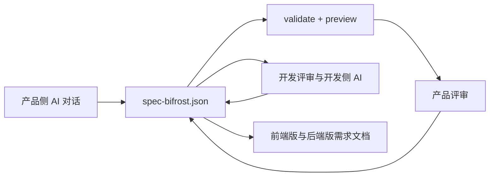

# Spec Bifrost 首批用户推广与反馈闭环 Implementation Plan

> **For agentic workers:** REQUIRED SUB-SKILL: Use superpowers:subagent-driven-development (recommended) or superpowers:executing-plans to implement this plan task-by-task. Steps use checkbox (`- [ ]`) syntax for tracking.

**Goal:** 在不修改产品代码的前提下，让外部产品研发团队能够理解、试跑并反馈 Spec Bifrost v0.4.1，获得至少三条有效外部反馈，并争取一个团队完成完整闭环。

**Architecture:** 以 GitHub README 为唯一事实源，采购系统示例作为当前演示入口，GitHub Issue Form 作为结构化反馈入口，中英文推广材料复用同一套价值叙事。执行阶段只修改文档和社区入口；外部反馈未达到解冻条件前，不修改 schema、renderer、CLI、hooks、skills 或其他产品行为。

**Tech Stack:** Markdown、GitHub Issue Forms、GitHub CLI、现有 Spec Bifrost v0.4.1、V2EX/掘金等中文社区、GitHub/Hacker News 等英文社区。

---

## 执行约束

- 产品版本固定使用 v0.4.1，不为推广另发功能版本。
- 不创建第二个示例，不修改采购系统 `spec-bifrost.json`。
- 不修改 `plugins/spec-bifrost/src`、`plugins/spec-bifrost/skills`、`plugins/spec-bifrost/hooks`、插件 manifest 或 `plugins/spec-bifrost/dist`。
- 不增加遥测、账号、云服务、数据库或表单后端。
- 不把 stars、浏览量、收藏或泛泛评价记为有效反馈。
- 真实用户或公司信息默认匿名化；未经对方明确同意，不把可识别信息提交到仓库。
- 安全漏洞和确认阻止安装或启动的严重缺陷可以中断本计划，按缺陷流程单独处理。

## 每周投入与节奏

- 总投入控制在每周 5–10 小时。
- 50% 用于发布和分发中英文内容。
- 30% 用于回复问题、追问试用阶段和整理反馈。
- 20% 用于根据证据调整 README、示例说明和反馈入口。
- 同一周期最多维护两个中文渠道和两个英文渠道；没有带来实际试用的渠道在双周复盘后暂停。
- 同一个核心内容复用为 README、长文、短帖和回复，不为每个平台重新生产一套事实。

## 文件结构

- `README.md`：中文事实源，解释产品与开发 AI 上下文断裂、共享需求资产和完整团队试用路径。
- `README.en.md`：英文事实源，与中文 README 表达同一产品定位和反馈入口。
- `plugins/spec-bifrost/README.md`：插件市场中的双语精简说明，与根 README 保持事实一致。
- `plugins/spec-bifrost/examples/procurement-system/README.md`：把现有示例改造成产品和开发可共同执行的团队试跑指南。
- `.github/ISSUE_TEMPLATE/adoption_feedback.yml`：收集实际试用场景、完成阶段、价值和阻塞。
- `.github/ISSUE_TEMPLATE/config.yml`：关闭无结构空白 issue，避免反馈缺少必要上下文。
- `docs/adoption/launch-kit.md`：中英文首轮推广文案和回复模板的唯一来源。
- `docs/adoption/feedback-review-template.md`：双周复盘模板，只记录匿名化事实和聚合结论。

### Task 1: 建立结构化试用反馈入口

**Files:**
- Create: `.github/ISSUE_TEMPLATE/adoption_feedback.yml`
- Modify: `.github/ISSUE_TEMPLATE/config.yml:1-5`

- [ ] **Step 1: 创建实际试用反馈表单**

创建 `.github/ISSUE_TEMPLATE/adoption_feedback.yml`：

```yaml
name: Trial feedback / 试用反馈
description: Share what happened after trying Spec Bifrost in a real B-end project.
title: "feedback: "
labels: ["user-feedback"]
body:
  - type: markdown
    attributes:
      value: |
        感谢实际试用 Spec Bifrost。请删除客户名称、业务数据和其他敏感信息。

        Thanks for trying Spec Bifrost. Remove customer names, business data, and other sensitive information before submitting.
  - type: dropdown
    id: team
    attributes:
      label: Team setup / 团队组合
      description: Who participated in the trial?
      options:
        - Product and engineering / 产品与开发
        - Product only / 仅产品
        - Engineering only / 仅开发
        - Founder or independent builder / 创始人或独立开发者
        - Other / 其他
    validations:
      required: true
  - type: textarea
    id: scenario
    attributes:
      label: B-end project scenario / B 端项目场景
      description: What kind of internal or business-facing system were you planning?
      placeholder: "Example: a new supplier onboarding and approval system."
    validations:
      required: true
  - type: checkboxes
    id: stages
    attributes:
      label: Completed stages / 已完成阶段
      description: Select every stage you actually completed.
      options:
        - label: Understood the shared-requirement workflow / 理解共享需求资产工作流
        - label: Installed Spec Bifrost / 完成安装
        - label: Ran the procurement example / 运行采购系统示例
        - label: Created a spec for our own project / 为自己的项目创建 spec
        - label: Completed product review / 完成产品评审
        - label: Completed engineering review / 完成开发评审
        - label: Exported frontend and backend requirement documents / 导出前后端需求文档
        - label: Reused it in another project / 在第二个项目继续使用
    validations:
      required: true
  - type: textarea
    id: value
    attributes:
      label: Concrete value / 具体价值
      description: What repeated explanation, context loss, or semantic drift did it reduce?
      placeholder: "Describe a before-and-after observation. Leave blank if the trial was blocked before value appeared."
    validations:
      required: false
  - type: textarea
    id: blocker
    attributes:
      label: Concrete blocker / 具体阻塞
      description: What exact step failed or became too costly?
      placeholder: "Include the command, stage, expected result, and actual result when possible."
    validations:
      required: false
  - type: dropdown
    id: outcome
    attributes:
      label: Current outcome / 当前结果
      options:
        - Completed the full workflow / 完成完整闭环
        - Partially completed and will continue / 部分完成并会继续
        - Blocked and cannot continue / 被阻塞，无法继续
        - Evaluated but decided not to continue / 评估后决定不继续
    validations:
      required: true
  - type: textarea
    id: next
    attributes:
      label: Most important next need / 最重要的下一步需求
      description: Name one change, document, or clarification that would most improve the workflow.
    validations:
      required: false
  - type: checkboxes
    id: privacy
    attributes:
      label: Privacy check / 隐私检查
      options:
        - label: I removed customer names, credentials, and sensitive business data. / 我已删除客户名称、凭据和敏感业务数据。
          required: true
```

- [ ] **Step 2: 关闭无结构空白 issue**

将 `.github/ISSUE_TEMPLATE/config.yml` 第一行改为：

```yaml
blank_issues_enabled: false
```

保留现有 Roadmap contact link。Bug、feature 和 trial feedback 三种表单继续并存。

- [ ] **Step 3: 验证反馈表单包含有效反馈的四项必要信息**

Run:

```bash
rg -n "team|scenario|stages|value|blocker|outcome|privacy" .github/ISSUE_TEMPLATE/adoption_feedback.yml
git diff --check
```

Expected:

- `rg` 命中团队组合、项目场景、完成阶段、价值/阻塞、结果和隐私确认。
- `git diff --check` 无输出。

- [ ] **Step 4: 创建 GitHub label**

Run:

```bash
gh label create user-feedback --color 0E8A16 --description "Feedback from an external user who tried Spec Bifrost"
```

Expected: GitHub 创建 `user-feedback` label；如果 label 已存在，确认其用途一致后继续。

- [ ] **Step 5: 提交反馈入口**

```bash
git add .github/ISSUE_TEMPLATE/adoption_feedback.yml .github/ISSUE_TEMPLATE/config.yml
git commit -m "docs(feedback): 增加结构化试用反馈入口"
```

### Task 2: 将 README 定位改为产品与开发共享需求资产

**Files:**
- Modify: `README.md:5-57`
- Modify: `README.md:149-202`
- Modify: `README.md:304-319`
- Modify: `README.md:366-382`
- Modify: `README.en.md:5-57`
- Modify: `README.en.md:149-202`
- Modify: `README.en.md:304-319`
- Modify: `README.en.md:366-382`
- Modify: `plugins/spec-bifrost/README.md:3-27`
- Modify: `plugins/spec-bifrost/README.md:115-152`
- Modify: `plugins/spec-bifrost/README.md:175-188`

- [ ] **Step 1: 替换中文 README 首屏定位**

将 `README.md` 第 5–18 行替换为：

```markdown
面向正在从零建设 B 端系统的产品研发团队：当产品和开发已经各自使用 AI、却没有共享上下文时，Spec Bifrost 用一份本地、可校验、可预览、可版本化的 `spec-bifrost.json` 连接双方。

产品用 AI 描述和审查需求，开发继续让 AI 读取同一份结构化需求资产。团队不需要先信任 AI 生成的生产代码，也不需要反复转述页面、字段、流程、规则和备注。

> 状态：MVP。当前版本重点验证“产品与开发能否围绕同一份 AI 可读需求资产完成评审和交接”，而不是继续扩展组件数量。


## 适合谁

- 正在从零规划内部系统、运营后台或其他 B 端系统的小公司和大公司。
- 产品和开发都已经使用 AI，但两侧对话、提示词和上下文彼此分离的团队。
- 不愿直接信任 AI 生成生产代码，希望先审查需求、原型和规则的团队。
- 愿意让产品与开发共同试跑完整流程，而不是只看一次原型演示的团队。
```

- [ ] **Step 2: 将中文核心链路补全为产品和开发共同评审**

将 `README.md` 的“为什么”段落和 Mermaid 流程替换为：

````markdown
## 为什么

产品和开发都在使用 AI，并不代表他们在共享上下文。产品侧 AI 形成原型或文档后，开发仍常常需要重新解释业务对象、字段口径、流程结果和例外，第二次转述会带来上下文丢失和语义漂移。

Spec Bifrost 验证的是一条共享需求资产链路：

1. 产品通过 Claude Code、Codex 或 OpenCode 描述一个新的 B 端系统。
2. AI 创建并修改本地 `spec-bifrost.json`。
3. 插件校验 JSON，并提供本地预览。
4. 产品根据预览修正页面、流程、字段、规则和备注。
5. 开发审查同一份 JSON，并让开发侧 AI 继续读取它。
6. 团队从同一份需求资产导出前端版和后端版需求文档。


````

- [ ] **Step 3: 在中文 5 分钟上手后增加团队试用和反馈 CTA**

在 `README.md` 第 202 行后增加：

```markdown
### 把示例升级为一次团队试用

仅运行采购系统示例可以确认安装和预览是否正常；有效试用还需要产品和开发共同完成以下步骤：

1. 用一个真实但已脱敏的新 B 端项目创建自己的 `spec-bifrost.json`。
2. 产品根据预览修正至少一处需求。
3. 开发审查同一份 JSON，并指出至少一处歧义、缺失或可直接复用的信息。
4. 导出前端版和后端版需求文档。
5. 提交[试用反馈](https://github.com/Liiaming/spec-bifrost/issues/new?template=adoption_feedback.yml)，说明完成阶段、具体价值或具体阻塞。

完整采购示例试跑指南见 [`plugins/spec-bifrost/examples/procurement-system/README.md`](plugins/spec-bifrost/examples/procurement-system/README.md)。
```

- [ ] **Step 4: 在中文贡献段落前增加反馈入口**

在 `README.md` 的“贡献”前增加：

```markdown
## 试用反馈

当前阶段优先收集真实团队的使用证据，而不是未试用的功能设想。如果你已经运行示例或为自己的 B 端项目创建了 spec，请提交[结构化试用反馈](https://github.com/Liiaming/spec-bifrost/issues/new?template=adoption_feedback.yml)。

有效反馈需要包含项目场景、完成阶段，以及具体价值或具体阻塞。请勿提交客户名称、凭据或敏感业务数据。
```

- [ ] **Step 5: 同步英文 README**

在 `README.en.md` 对应位置写入与中文相同事实的英文版本：

```markdown
Spec Bifrost is for product and engineering teams planning new business-facing systems. When both sides already use AI but do not share context, Spec Bifrost connects them through a local, validatable, previewable, and versionable `spec-bifrost.json`.

Product works with AI to describe and review requirements. Engineering and its AI tools continue from the same structured requirement artifact. The team does not need to trust AI-generated production code first, or repeatedly explain pages, fields, flows, rules, and notes.

> Status: MVP. The current version is focused on validating whether product and engineering can review and hand off one shared AI-readable requirement artifact, not on adding more component types.
```

“Who It Is For”使用：

```markdown
- Small and large companies planning a new internal tool, operations platform, or other business-facing system.
- Teams where product and engineering both use AI, but their conversations, prompts, and context remain disconnected.
- Teams that do not fully trust AI-generated production code and want reviewable requirements, prototypes, and rules first.
- Teams willing to run the full workflow with both product and engineering, rather than only view a generated prototype.
```

英文流程必须包含：

```markdown
1. Product describes a new business-facing system in Claude Code, Codex, or OpenCode.
2. AI creates and edits the local `spec-bifrost.json`.
3. The plugin validates the JSON and serves a local preview.
4. Product corrects pages, flows, fields, rules, and notes from the preview.
5. Engineering reviews the same JSON and lets engineering-side AI continue from it.
6. The team exports frontend and backend requirement documents from the same artifact.
```

英文 CTA 使用：

```markdown
## Trial Feedback

The current phase prioritizes evidence from real trials over feature ideas from people who have not tried the workflow. If you ran the example or created a spec for your own business-facing project, submit [structured trial feedback](https://github.com/Liiaming/spec-bifrost/issues/new?template=adoption_feedback.yml).

Useful feedback includes the project scenario, completed stage, and a concrete value or blocker. Do not submit customer names, credentials, or sensitive business data.
```

- [ ] **Step 6: 同步插件 README 的双语事实**

在 `plugins/spec-bifrost/README.md` 中：

- 将目标用户从“产品经理、独立开发者和小团队”改为“正在规划新 B 端系统、且产品与开发 AI 上下文分离的产品研发团队”。
- 在 Mermaid 中增加 `产品评审 / Product review` 和 `开发评审 / Engineering review`。
- 在 5 分钟上手末尾增加双语反馈链接。
- 在示例段落说明：运行示例只验证安装；完整试用还需要自己的真实脱敏项目、产品评审、开发评审和导出。

反馈链接固定为：

```markdown
https://github.com/Liiaming/spec-bifrost/issues/new?template=adoption_feedback.yml
```

- [ ] **Step 7: 验证三份 README 事实同步**

Run:

```bash
rg -n "共享需求资产|产品评审|开发评审|adoption_feedback" README.md plugins/spec-bifrost/README.md
rg -n "shared.*requirement|Product review|Engineering review|adoption_feedback" README.en.md plugins/spec-bifrost/README.md
git diff --check
```

Expected:

- 中文和英文都明确产品与开发共享同一份需求资产。
- 三份 README 都包含结构化反馈入口。
- 无产品代码、插件行为或版本号变化。

- [ ] **Step 8: 提交 README 定位调整**

```bash
git add README.md README.en.md plugins/spec-bifrost/README.md
git commit -m "docs(readme): 聚焦产品与开发共享需求资产"
```

### Task 3: 把采购示例改造成团队试跑指南

**Files:**
- Modify: `plugins/spec-bifrost/examples/procurement-system/README.md:1-52`

- [ ] **Step 1: 保留现有命令并增加试跑目标**

将文件开头改为：

```markdown
# 采购申请管理系统团队试跑指南

这个示例用于确认 Spec Bifrost v0.4.1 的完整链路：同一份结构化需求资产能否被产品审查、被开发继续理解，并导出两份角色关注点不同但事实一致的需求文档。

运行示例只验证安装、校验和预览是否正常。要形成有效反馈，还需要把同一流程用于一个真实但已脱敏的新 B 端项目。

## 参与角色

- 产品：描述业务目标，检查页面、流程、字段、规则和备注是否准确。
- 开发：检查业务对象、字段口径、流程结果、例外和缺失信息是否足以继续理解需求。

## 第一步：运行现有示例
```

原有复制、校验、预览和导出命令保持不变。

- [ ] **Step 2: 在命令后增加产品评审清单**

```markdown
## 第二步：产品评审

在预览中至少检查：

- 页面是否覆盖申请、审批、采购执行和结果查看。
- 关键字段、必填条件和状态是否符合业务语言。
- 页面跳转、条件显示和操作反馈是否表达清楚。
- notes 是否保留了无法仅靠组件结构表达的规则和例外。

产品应实际修改至少一处 `spec-bifrost.json`，再次运行校验并刷新预览。
```

- [ ] **Step 3: 增加开发评审清单**

```markdown
## 第三步：开发评审

开发不需要信任或生成生产代码，只需围绕同一份 `spec-bifrost.json` 检查：

- 业务对象和字段口径是否一致。
- 状态流转、成功结果、驳回结果和例外是否可理解。
- 前后页面引用和动作目标是否明确。
- 哪些信息可以直接供开发侧 AI 继续理解，哪些仍需产品重复解释。

开发应记录至少一处明确价值或一处明确阻塞，避免只给“看起来不错”之类评价。
```

- [ ] **Step 4: 增加真实项目闭环和反馈入口**

```markdown
## 第四步：用于自己的新 B 端项目

1. 在一个脱敏项目中运行 `/spec-bifrost:spec`。
2. 生成并修改自己的 `spec-bifrost.json`。
3. 完成产品评审和开发评审。
4. 运行 `/spec-bifrost:export`。
5. 确认两份需求文档事实一致，且都没有进入接口、数据库、架构、代码或任务拆分。

完成或被阻塞后，提交[结构化试用反馈](https://github.com/Liiaming/spec-bifrost/issues/new?template=adoption_feedback.yml)。反馈至少说明团队组合、项目场景、完成阶段，以及具体价值或阻塞。
```

保留原有“覆盖能力”和“边界”两节。

- [ ] **Step 5: 验证示例没有发生行为变化**

Run:

```bash
npm run spec-bifrost -- validate --cwd plugins/spec-bifrost/examples/procurement-system
git diff -- plugins/spec-bifrost/examples/procurement-system/spec-bifrost.json
git diff --check
```

Expected:

- 示例 JSON 校验成功。
- 示例 JSON 无 diff。
- 只有示例 README 发生变化。

- [ ] **Step 6: 提交团队试跑指南**

```bash
git add plugins/spec-bifrost/examples/procurement-system/README.md
git commit -m "docs(example): 增加产品开发团队试跑指南"
```

### Task 4: 创建可复用的中英文首轮推广材料

**Files:**
- Create: `docs/adoption/launch-kit.md`

- [ ] **Step 1: 写入统一事实和禁用表述**

创建 `docs/adoption/launch-kit.md`，文件开头包含：

```markdown
# Spec Bifrost 首轮推广材料

## 统一事实

- 当前版本：v0.4.1。
- 目标用户：正在从零建设 B 端系统，且产品与开发都在使用 AI 的小公司和大公司。
- 核心问题：产品侧 AI 与开发侧 AI 没有共享上下文，需求被重复转述并发生语义漂移。
- 核心机制：本地、可校验、可预览、可版本化的 `spec-bifrost.json`。
- 核心边界：不生成生产代码、接口定义、数据库设计、技术架构或任务拆分。
- 当前请求：邀请真实产品研发团队完成试用并反馈，而不是征集抽象功能点。

## 不使用的表述

- 不声称已有团队采用或已证明能提升效率。
- 不把它描述为低代码平台、AI 编程工具或高保真设计工具。
- 不主打组件数量。
- 不承诺节省固定比例的时间或 token。
- 不使用“颠覆”“革命性”“全自动”等无法验证的词。
```

- [ ] **Step 2: 写入中文长文**

中文长文标题固定为：

```text
产品和开发都在用 AI，为什么需求仍然要重复讲一遍？
```

正文使用以下结构和完整观点：

```markdown
很多团队已经不是“要不要用 AI”的阶段了。

产品用 AI 梳理流程、写需求、做原型；开发用 AI 读代码、生成实现、排查问题。但两边的 AI 上下文通常没有联通。产品得到的页面、字段、规则和备注，到了开发侧仍要重新解释一次。第二次转述之后，业务口径、状态流转和例外很容易漂移。

直接让 AI 生成代码也不能解决这个问题。对真实 B 端系统，团队通常不会完全信任一次生成的生产代码；在代码之前，仍需要一份可以检查、讨论和版本化的需求资产。

我在做的 Spec Bifrost 尝试把这层资产固定为本地 `spec-bifrost.json`：

1. 产品通过 Claude Code、Codex 或 OpenCode 描述一个新 B 端系统。
2. AI 生成并修改结构化 JSON。
3. 插件校验 JSON，并渲染多页面需求原型。
4. 产品根据预览修正需求。
5. 开发和开发侧 AI 继续读取同一份 JSON。
6. 团队从同一份资产导出前端版和后端版需求文档。

它刻意不做生产代码、接口、数据库、架构和任务拆分。当前要验证的也不是“还能增加什么组件”，而是产品与开发是否真的能少做一次重复转述。

项目目前是 v0.4.1，包含一个采购申请管理系统示例。现在希望找到正在从零规划内部系统或其他 B 端系统的产品 + 开发组合，实际完成一次流程。

仓库：https://github.com/Liiaming/spec-bifrost

如果你试过，请不要只说“不错”或列功能愿望。更有价值的是告诉我：

- 你们在规划什么类型的 B 端系统；
- 完成到了安装、示例、自有 spec、产品评审、开发评审还是文档导出；
- 它具体减少了什么重复解释，或者在哪一步被阻塞。

结构化反馈入口：https://github.com/Liiaming/spec-bifrost/issues/new?template=adoption_feedback.yml
```

- [ ] **Step 3: 写入中文短帖**

```markdown
产品和开发都在用 AI，但两边的 AI 上下文通常没有联通。

Spec Bifrost 用一份本地、可校验、可预览、可版本化的 `spec-bifrost.json` 连接产品评审和开发评审，再从同一份需求资产导出前后端需求文档。

它不生成生产代码、接口、数据库或技术架构。当前 v0.4.1 不继续加功能，先找真实 B 端团队验证完整流程。

项目：https://github.com/Liiaming/spec-bifrost
试用反馈：https://github.com/Liiaming/spec-bifrost/issues/new?template=adoption_feedback.yml
```

- [ ] **Step 4: 写入英文 Show HN 文案**

标题：

```text
Show HN: Spec Bifrost – a shared AI-readable requirements artifact before code
```

正文：

```markdown
Product and engineering teams increasingly use AI on both sides, but the context usually stays disconnected. Product may use AI for flows, requirements, and prototypes; engineering then has to explain the same pages, fields, rules, and exceptions again to its own AI tools.

Spec Bifrost explores a shared artifact between those workflows: a local `spec-bifrost.json` that is validatable, previewable, versionable, and readable by both product-side and engineering-side AI.

The workflow is:

1. Product describes a new business-facing system in Claude Code, Codex, or OpenCode.
2. AI creates and edits `spec-bifrost.json`.
3. The plugin validates it and renders a multi-page requirement prototype.
4. Product reviews and corrects the same artifact.
5. Engineering and engineering-side AI continue from it.
6. The team exports frontend and backend requirement documents from the same source.

It deliberately does not generate production code, APIs, database designs, architecture, or task breakdowns. The current question is whether this reduces repeated explanation and semantic drift before implementation.

The project is at v0.4.1 and includes a procurement-system example. I am looking for product + engineering teams planning a real new internal or business-facing system who are willing to try the full workflow.

Repository: https://github.com/Liiaming/spec-bifrost
Structured trial feedback: https://github.com/Liiaming/spec-bifrost/issues/new?template=adoption_feedback.yml
```

- [ ] **Step 5: 写入英文短帖**

```markdown
Product and engineering both use AI, but their AI context rarely connects.

Spec Bifrost uses one local, validatable, previewable, and versionable `spec-bifrost.json` for product review, engineering review, and frontend/backend requirement exports.

It does not generate production code, APIs, databases, architecture, or task breakdowns. v0.4.1 is now focused on real team trials instead of more features.

Project: https://github.com/Liiaming/spec-bifrost
Trial feedback: https://github.com/Liiaming/spec-bifrost/issues/new?template=adoption_feedback.yml
```

- [ ] **Step 6: 写入公开回复模板**

在文件末尾增加：

```markdown
## 回复模板

### 对方只评价“不错”

谢谢。当前最需要的不是泛泛评价，而是实际试跑证据。如果方便，请告诉我：你是否运行过示例或创建过自己的 spec，完成到了哪个阶段，在哪一步获得价值或被阻塞？

### 对方直接提出功能

我会先记录，但当前不会因为单条功能建议改产品。想确认一下：这个需求来自实际试用中的哪一步？它是否阻止了你完成产品评审、开发评审或文档导出？

### 对方遇到安装问题

请提供 Spec Bifrost 版本、AI 工具、操作系统、执行命令、预期结果和实际输出，并删除路径中的客户名称或敏感信息。如果问题可复现且阻止安装或启动，会按严重缺陷优先处理。

### 对方完成部分流程

请补充项目场景、产品和开发是否都参与、完成阶段，以及最具体的一项价值或阻塞。可以直接使用结构化反馈表单：
https://github.com/Liiaming/spec-bifrost/issues/new?template=adoption_feedback.yml
```

- [ ] **Step 7: 验证推广材料没有未经验证的承诺**

Run:

```bash
rg -n "v0\\.4\\.1|重复转述|shared artifact|不生成生产代码|does not generate production code|adoption_feedback" docs/adoption/launch-kit.md
rg -n "提升 [0-9]+%|节省 [0-9]+%|已有.*团队|revolutionary|fully automated" docs/adoption/launch-kit.md
git diff --check
```

Expected:

- 第一条命令命中统一事实和反馈入口。
- 第二条命令无输出。
- `git diff --check` 无输出。

- [ ] **Step 8: 提交推广材料**

```bash
git add docs/adoption/launch-kit.md
git commit -m "docs(marketing): 准备首轮中英文推广材料"
```

### Task 5: 发布首轮内容并处理反馈

**Files:**
- Reference: `docs/adoption/launch-kit.md`
- Reference: `README.md`
- Reference: `README.en.md`
- Reference: `.github/ISSUE_TEMPLATE/adoption_feedback.yml`

- [ ] **Step 1: 推送仓库文档变更**

Run:

```bash
git push origin main
```

Expected: GitHub 默认分支出现新的定位、团队试跑指南和 trial feedback 表单。

- [ ] **Step 2: 验证公开反馈表单**

打开：

```text
https://github.com/Liiaming/spec-bifrost/issues/new?template=adoption_feedback.yml
```

Expected:

- 页面显示 Trial feedback / 试用反馈。
- 团队组合、B 端场景、完成阶段和结果为必填。
- 页面没有要求用户上传完整或敏感的 `spec-bifrost.json`。

- [ ] **Step 3: 发布第一条中文内容**

执行规则：

1. 在 V2EX 与掘金中选择已有账号历史互动更高的一个作为首发渠道。
2. 长文渠道使用 `docs/adoption/launch-kit.md` 的中文长文；短帖渠道使用中文短帖。
3. 标题从“产品和开发都在用 AI，为什么需求仍然要重复讲一遍？”开始，不改成组件或原型展示标题。
4. 正文保留 GitHub 仓库和结构化反馈两个链接。
5. 发布后 48 小时只回复真实问题，不追加新功能承诺。

Expected: 至少一条公开中文内容上线，并能从帖子进入 README 和反馈表单。

- [ ] **Step 4: 发布第一条英文内容**

执行规则：

1. 优先使用 Hacker News 的 Show HN 文案；如果账号条件不适合发 Show HN，则使用英文短帖发布到已有受众基础最好的 GitHub/Dev.to/Reddit 渠道。
2. 保留 “shared AI-readable requirements artifact before code” 核心叙事。
3. 不把产品描述成 code generator 或 prototyping tool。
4. 保留仓库和 structured trial feedback 链接。

Expected: 至少一条公开英文内容上线，并能从帖子进入 README 和反馈表单。

- [ ] **Step 5: 用统一问题追问潜在试用者**

对表示愿意尝试的人，只追问以下四项：

```text
1. 你们在规划什么类型的新 B 端系统？
2. 产品和开发是否都会参与？
3. 目前完成到示例、自有 spec、产品评审、开发评审还是文档导出？
4. 最具体的价值或阻塞是什么？
```

Expected: 每条被计入的有效反馈都能回答场景、参与角色、完成阶段和价值/阻塞。

- [ ] **Step 6: 严格应用代码冻结规则**

收到反馈时：

- 单条功能建议：记录，不改代码。
- 未试用的意见：回复试用路径，不计入有效反馈。
- 可复现且阻止安装/启动：创建 bug issue，允许单独评估修复。
- 三个外部用户报告同一工作流阻塞：进入代码解冻评估。
- 一个团队完成闭环并给出核心协作需求：进入代码解冻评估。

Expected: 首轮推广期间没有因为单个评论修改产品代码。

### Task 6: 建立双周反馈复盘

**Files:**
- Create: `docs/adoption/feedback-review-template.md`

- [ ] **Step 1: 创建匿名化复盘模板**

创建 `docs/adoption/feedback-review-template.md`：

```markdown
# Spec Bifrost 双周推广与反馈复盘

## 周期

- 开始日期：
- 结束日期：
- 本周期投入小时：

## 触达

| 渠道 | 内容链接 | 浏览/互动 | 进入试用的明确人数 |
| --- | --- | ---: | ---: |

触达数据只用于判断渠道，不作为产品开发证据。

## 有效反馈

| 匿名编号 | 团队组合 | B 端场景 | 最远完成阶段 | 具体价值 | 具体阻塞 | 证据链接 |
| --- | --- | --- | --- | --- | --- | --- |

有效反馈必须来自实际试用者，并同时包含场景、完成阶段和具体价值或阻塞。

## 漏斗

| 阶段 | 人数 |
| --- | ---: |
| 理解价值 | 0 |
| 完成安装 | 0 |
| 运行示例 | 0 |
| 创建自己的 spec | 0 |
| 完成产品评审 | 0 |
| 完成开发评审 | 0 |
| 完成前后端文档导出 | 0 |
| 在第二个项目继续使用 | 0 |

## 重复证据

- 是否出现三个外部用户报告同一工作流阻塞：否
- 是否有团队完成完整闭环：否
- 是否有完成闭环的团队提出与共享需求资产一致的明确需求：否
- 是否出现可复现的严重安装或启动缺陷：否

## 本周期结论

从以下结论中只保留符合事实的一项：

- 有访问但无试用：下一周期只改定位、安装路径或演示说明。
- 有试用但无反馈：下一周期只改反馈入口和追问方式。
- 有反馈但无闭环：继续记录阻塞，保持产品代码冻结。
- 用户只关注原型生成：调整内容叙事，强化共享需求资产。
- 用户认可协作价值：继续寻找重复证据，不立即开发功能。
- 满足代码解冻条件：另起设计文档评估，不在本复盘中直接实现。

## 下一周期动作

最多三项，每项必须直接对应本周期证据：

1.
2.
3.

## 隐私检查

- 未记录客户名称、真实业务数据、凭据或未获授权的个人身份信息。
- 对外引用反馈前已获得明确同意，或已做不可逆匿名化。
```

- [ ] **Step 2: 验证模板符合反馈定义**

Run:

```bash
rg -n "团队组合|B 端场景|最远完成阶段|具体价值|具体阻塞|三个外部用户|完整闭环|隐私" docs/adoption/feedback-review-template.md
git diff --check
```

Expected: 所有有效反馈字段、解冻条件和隐私约束都有命中。

- [ ] **Step 3: 提交复盘模板**

```bash
git add docs/adoption/feedback-review-template.md
git commit -m "docs(feedback): 增加双周推广复盘模板"
```

- [ ] **Step 4: 在发布后第 14 天执行第一次复盘**

复制模板为本地工作文件或匿名化公开复盘。若包含未获授权的用户信息，不提交仓库。

第一次复盘只回答：

1. 哪个渠道带来了实际试用，而不只是浏览？
2. 用户最远完成到哪个阶段？
3. 是否有重复阻塞或明确协作价值？
4. 下一周期最多做哪三项文档或推广调整？
5. 是否满足代码解冻条件？

Expected: 形成一个有证据的继续、调整渠道或解冻评估结论。

- [ ] **Step 5: 在第 8–12 周执行停止条件**

如果连续 8 周没有获得任何有效外部反馈：

1. 暂停继续增加推广材料。
2. 检查现有渠道是否能触达真实产品 + 开发组合。
3. 检查用户是否只理解为原型生成器。
4. 直接访谈已点击或互动但未试用的人，确认是触达、安装、价值叙事还是问题强度不足。

如果到第 12 周仍没有有效反馈，形成“继续换渠道、调整目标用户或停止当前方向”的明确结论。不得通过新增产品功能制造进展感。

### Task 7: 完成仓库级验证

**Files:**
- Verify only: all changed files

- [ ] **Step 1: 确认没有产品代码变化**

Run:

```bash
git diff e6eaee8..HEAD --name-only
```

Expected: 仅出现：

```text
.github/ISSUE_TEMPLATE/adoption_feedback.yml
.github/ISSUE_TEMPLATE/config.yml
README.md
README.en.md
docs/adoption/feedback-review-template.md
docs/adoption/launch-kit.md
docs/superpowers/plans/2026-06-20-spec-bifrost-adoption-execution.md
plugins/spec-bifrost/README.md
plugins/spec-bifrost/examples/procurement-system/README.md
```

不得出现 `src`、`skills`、`hooks`、manifest、schema、测试或 `dist`。

- [ ] **Step 2: 运行默认检查**

Run:

```bash
npm run check
```

Expected: 构建成功，全部测试通过。

- [ ] **Step 3: 运行文档一致性检查**

Run:

```bash
rg -n "adoption_feedback.yml" README.md README.en.md plugins/spec-bifrost/README.md plugins/spec-bifrost/examples/procurement-system/README.md docs/adoption/launch-kit.md
rg -n "生产代码|production code|接口定义|API|数据库|database|技术架构|architecture|任务拆分|task breakdown" README.md README.en.md plugins/spec-bifrost/README.md docs/adoption/launch-kit.md
git diff --check
git status --short
```

Expected:

- 所有用户入口都指向同一个反馈表单。
- 中英文材料都保留产品边界。
- `git diff --check` 无输出。
- 工作区只有计划内文件，或在提交后为空。

## 阶段完成标准

仓库准备完成：

- README 首屏明确“产品与开发 AI 上下文断裂”和“共享需求资产”。
- 采购示例包含产品评审、开发评审和真实项目闭环说明。
- GitHub 提供结构化 trial feedback 表单。
- 中英文首轮推广文案可以直接发布。
- 双周复盘模板能区分触达、有效反馈和代码解冻证据。
- 产品代码保持不变，`npm run check` 通过。

推广验证完成：

- 至少三条有效外部反馈。
- 至少一个外部团队完成完整闭环。
- 至少两个外部用户明确指出减少了重复转述、上下文丢失或语义漂移中的至少一项。
- 发现满足代码解冻条件的重复问题或明确需求，或证据表明当前产品已足够完成目标工作流。
