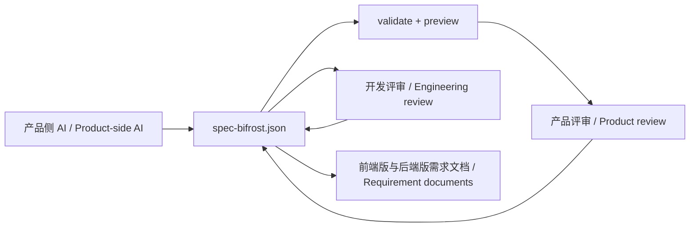

# Spec Bifrost

Spec Bifrost 面向正在规划新 B 端系统、但产品侧 AI 与开发侧 AI 上下文彼此分离的产品研发团队。它把 AI 需求协作沉淀为本地、可校验、可预览、可版本化的 `spec-bifrost.json` 共享需求资产，供产品和开发共同评审，并导出前端版和后端版需求文档。

Spec Bifrost is for product and engineering teams planning new business-facing systems while product-side and engineering-side AI remain disconnected. It captures AI requirement collaboration in a local, validatable, previewable, and versionable `spec-bifrost.json` as a shared requirement artifact, then exports frontend and backend requirement documents.


## 为什么不是直接让 AI 写需求文档 / Why not just ask AI to write requirements directly

直接让 AI 写文档很快，但产品侧 AI 形成的页面、字段、备注、交互规则和业务口径，到了开发侧通常仍需重复解释。Spec Bifrost 先把需求落到可校验、可预览、可迭代的 JSON 中间层，让产品评审和开发评审围绕同一份结构化上下文进行。

Direct AI-generated documents are fast, but pages, fields, notes, interaction rules, and business meanings from product-side AI usually need to be explained again to engineering-side AI. Spec Bifrost captures requirements in a validatable, previewable, and editable JSON layer so product review and engineering review use the same structured context.

相比“产品用 AI 生成原型，再由开发用 AI 将原型转换为代码或需求说明”，Spec Bifrost 围绕紧凑的 `spec-bifrost.json` 迭代，通常更省 token，也更适合 token 成本敏感的早期产品阶段。

Compared with a workflow where product uses AI to generate a prototype and developers then use AI for prototype-to-code or prototype-to-requirements conversion, Spec Bifrost iterates around a compact `spec-bifrost.json`. This is a more token-efficient fit when token budget matters during early product work.



## 能做什么 / What It Does

- 通过聊天指导 Claude Code、Codex 或 OpenCode 创建和修改 `spec-bifrost.json`。
- Guides Claude Code, Codex, or OpenCode to create and modify `spec-bifrost.json` through chat.
- 校验 JSON 语法、schema 和引用完整性。
- Validates JSON syntax, schema, and references.
- 启动多页面 B 端原型的本地预览。
- Starts a local preview for multi-page B-end prototypes.
- 在预览中用临时字段值驱动条件显示、条件必填、条件禁用和条件动作跳转。
- Uses temporary preview field values for conditional display, required state, disabled state, and action navigation.
- 支持指标、分组视图、弹窗、抽屉、时间线、树形层级、附件字段和批量操作等更复杂的需求表达。
- Supports more complex requirement expression through metrics, tabs, modals, drawers, timelines, tree structures, file fields, and batch actions.
- 支持可编辑明细、层级表格、对比表、看板、工作流、向导、进度、结果反馈、图表、日历、甘特、权限矩阵、规则清单、检查清单、审计日志、附件列表、评论串、组织结构、折叠面板和关系图。
- Supports editable tables, tree tables, comparison tables, kanban boards, workflows, wizards, progress trackers, result panels, charts, calendars, gantt plans, permission matrices, rule lists, checklists, audit logs, attachment lists, comment threads, org charts, collapse panels, and relation graphs.
- 当前 JSON 无法渲染时，保留上一版有效预览。
- Keeps last known good preview output when the current JSON cannot render.
- 指导 Claude Code、Codex 或 OpenCode 导出前端和后端 Markdown 需求文档。
- Guides Claude Code, Codex, or OpenCode to export frontend and backend Markdown requirement documents.

## 不做什么 / What It Does Not Do

- 不生成生产代码。
- It does not generate production code.
- 不创建接口定义。
- It does not create API definitions.
- 不创建数据库表。
- It does not create database tables.
- 不创建技术架构。
- It does not create technical architecture.
- 不创建任务拆分。
- It does not create task breakdowns.
- 不持久化预览输入数据。
- It does not persist preview input data.
- 不上传需求数据。
- It does not upload requirement data.

## 命令 / Commands

```txt
/spec-bifrost:spec
/spec-bifrost:validate
/spec-bifrost:preview
/spec-bifrost:refresh
/spec-bifrost:export
/spec-bifrost:stop
```

OpenCode 使用 hyphenated 命令名 / OpenCode uses hyphenated command names:

```txt
/spec-bifrost-spec
/spec-bifrost-validate
/spec-bifrost-preview
/spec-bifrost-refresh
/spec-bifrost-export
/spec-bifrost-stop
```

## 安装 / Install

```bash
claude plugin marketplace add Liiaming/spec-bifrost
claude plugin install spec-bifrost@spec-bifrost-marketplace
```

```bash
codex plugin marketplace add Liiaming/spec-bifrost
codex plugin add spec-bifrost@spec-bifrost-marketplace
```

OpenCode 不使用 Claude/Codex marketplace。保留或 clone 本仓库后，在目标项目目录用仓库内配置启动：

OpenCode does not use the Claude/Codex marketplace. Keep or clone this repository, then start OpenCode in the target project directory with the repository-provided config:

```bash
OPENCODE_CONFIG=/path/to/spec-bifrost/plugins/spec-bifrost/opencode.json opencode
```

`OPENCODE_CONFIG` 加载 `plugins/spec-bifrost/opencode.json` 中的 `/spec-bifrost-*` 命令。命令模板会通过 OpenCode 的 `{file:...}` 变量内联同目录下的 skill 文档，不依赖额外的 skill discovery。

`OPENCODE_CONFIG` loads the `/spec-bifrost-*` commands from `plugins/spec-bifrost/opencode.json`. The command templates inline the sibling skill documents through OpenCode `{file:...}` variables, so they do not rely on additional skill discovery.

发布版本必须包含 `dist`，安装后 CLI 才能直接运行。

Published versions must include `dist` so the CLI can run immediately after install.

## 5 分钟上手 / 5-Minute Quick Start

```txt
/spec-bifrost:spec
创建一个采购申请管理系统，包含申请单列表、创建申请、审批详情和基础审批流程。
```

```txt
/spec-bifrost:validate
/spec-bifrost:preview
/spec-bifrost:export
```

OpenCode:

```txt
/spec-bifrost-spec
/spec-bifrost-validate
/spec-bifrost-preview
/spec-bifrost-export
```

默认预览地址是 `http://127.0.0.1:3737`。如果端口没有释放，运行 `/spec-bifrost:stop`。

The default preview URL is `http://127.0.0.1:3737`. If the port is still occupied, run `/spec-bifrost:stop`.

导出文档默认写入：

Exported documents are expected at:

```txt
docs/spec-bifrost/frontend-requirements.md
docs/spec-bifrost/backend-requirements.md
```

前端版需求文档关注页面清单、页面流程、页面级说明、字段级说明和操作反馈；后端版需求文档关注业务对象与字段口径、业务规则、流程结果、例外与备注。两份文档都应保持需求文档属性，不包含接口定义、数据库设计、技术架构、代码结构或任务拆分。

The frontend version should cover pages, flows, page-level details, field-level rules, and user-facing feedback. The backend version should cover business objects, field meanings, business rules, process outcomes, exceptions, and notes. Both documents remain requirement documents, not API definitions, database designs, architecture, code structure, or task breakdowns.

仅运行采购系统示例可以确认安装、校验和预览是否正常。完整试用还需要在一个真实但已脱敏的新 B 端项目中创建自己的 spec，完成产品评审、开发评审和文档导出。

Running the procurement example confirms installation, validation, and preview behavior. A complete trial also requires a real but sanitized new business-facing project, your own spec, product review, engineering review, and document export.

完成或被阻塞后，请提交结构化试用反馈：

After completing the workflow or getting blocked, submit structured trial feedback:

https://github.com/Liiaming/spec-bifrost/issues/new?template=adoption_feedback.yml

## 本地安装 / Local Install

```bash
codex plugin marketplace add /path/to/spec-bifrost
codex plugin add spec-bifrost@spec-bifrost-marketplace
```

OpenCode:

```bash
OPENCODE_CONFIG=/path/to/spec-bifrost/plugins/spec-bifrost/opencode.json opencode
```

## 本地 CLI / Local CLI

```bash
spec-bifrost validate --cwd "${CLAUDE_PROJECT_DIR:-$PWD}"
spec-bifrost preview --cwd "${CLAUDE_PROJECT_DIR:-$PWD}" --host 127.0.0.1 --port 3737
spec-bifrost refresh --cwd "${CLAUDE_PROJECT_DIR:-$PWD}"
```

## 示例 / Example

使用 `examples/procurement-system/spec-bifrost.json` 验证安装、校验、预览和导出，再在自己的真实脱敏项目中完成产品与开发共同试跑。

Use `examples/procurement-system/spec-bifrost.json` to verify installation, validation, preview, and export, then run the product-and-engineering workflow on your own real but sanitized project.

示例目录包含一组前端版和后端版导出样例：

The example directory also includes frontend and backend export samples:

```txt
examples/procurement-system/docs/spec-bifrost/frontend-requirements.md
examples/procurement-system/docs/spec-bifrost/backend-requirements.md
```
